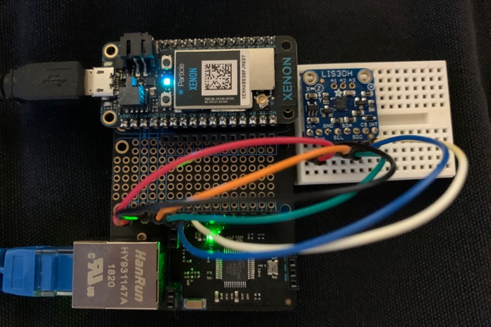
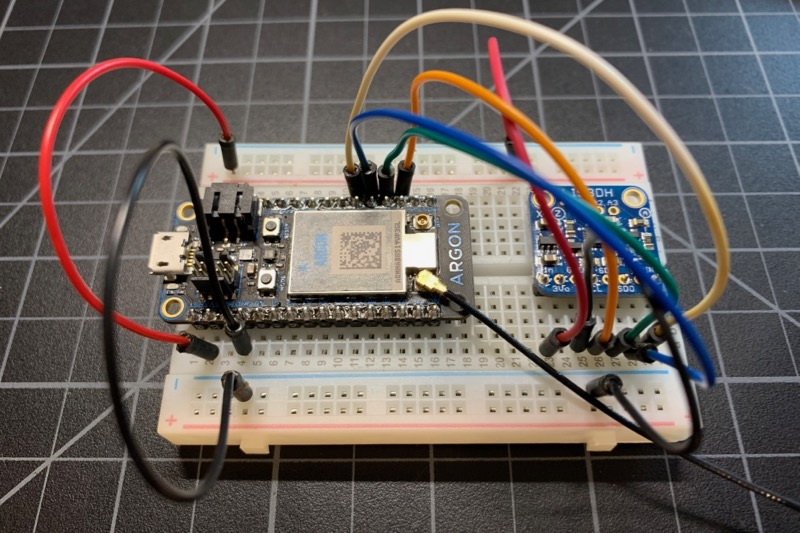
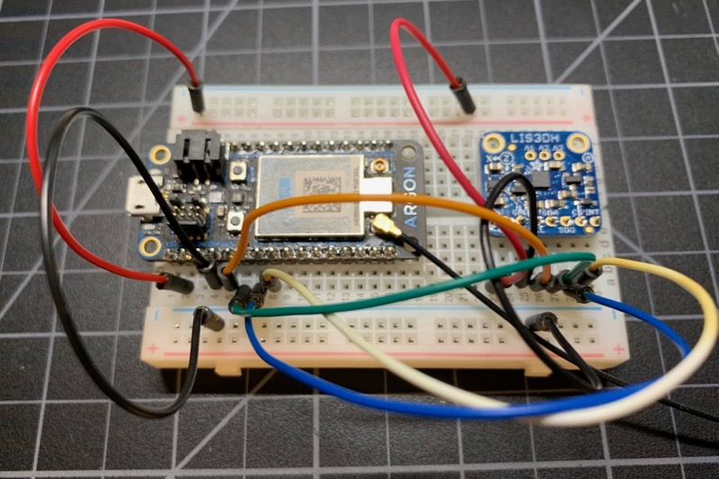
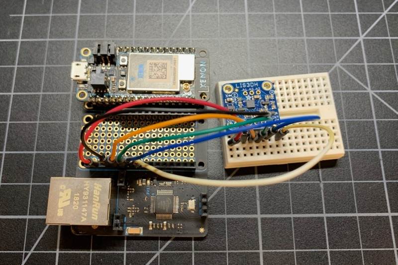

# SPI1 Reconfiguration

One often requested feature is to remap SPI1 from D2, D3, D4 to other pins. The reason is that pins D3 and D4 are used by the Ethernet FeatherWing, and are not easily reconfigured. This prevents using the SPI1 secondary SPI interface when using Ethernet. 

As it turns out, you can map most ports on the nRF52840 on Gen 3 devices (Argon, Boron, Xenon) from user firmware! 

This was also made worse because prior to Device OS 1.5.0, you could not share the Primary SPI interface used by the Ethernet FeatherWing with other SPI peripherals. With newer Device OS, you can, but sometimes you still might want to have two separate SPI busses.

Here's the Ethernet FeatherWing with a Xenon (no mesh configured), connected and breathing cyan, while a LIS3DH accelerometer is connected to SPI1 on alternative pins!



Normally SPI1 uses these pins:

| SPI Function | Pin |
| --- | :---: |
| SCK | D2 |
| MOSI | D3 |
| MISO | D4 |
| CS | any |

For testing purposes, I used a LIS3DH accelerometer from [Adafruit](https://www.adafruit.com/product/2809). No particular reason, I just needed a SPI device and had one handy.

This is not officially supported and may not work in the future.

## Testing (before change)

First test it before making the change so you know things are working properly.

| LIS3DH Pin | Particle Pin | Color | Function |
| :---: | :---: | :---: | :--- |
| VIN | 3V3 | Red | 3.3V power |
| 3Vo | | | Power out (not used) |
| GND | GND | Black | Ground |
| SCL | D2 | Orange | SCK (SPI Clock) |
| SDA | D3 | Green | MOSI |
| SDO | D4 | Blue | MISO |
| CS | D5 | White  | CS |
| INT | | | Interrupt (not used) | 



Note that the LIS3DH works in both SPI and I2C mode, which is why the pins names are not very SPI-like, but it really does support SPI.


```
0000011120 [app] INFO: -13376,-1024,7552
0000011370 [app] INFO: -6144,640,15296
0000011620 [app] INFO: -1600,2624,17408
0000011870 [app] INFO: -6144,1536,14912
0000012120 [app] INFO: -13504,-896,8704
0000012370 [app] INFO: -15232,832,576
```

If you move the board around the numbers should change. If the SPI communication does not work, you'll get 

```
0000090792 [app] INFO: no sample
0000091042 [app] INFO: no sample
0000091292 [app] INFO: no sample
```

In certain cases, you might get -1,-1,-1 as well.

## With SPI Reconfiguration

You can move the functions to any unused pins, but for this test I selected:

| SPI Function | Pin | Hardware Pin |
| --- | :---: | :--- |
| SCK | A0 | P0.3 | 
| MOSI | A1 | P0.4 | 
| MISO | A2 | P0.28 |
| CS | A3 | P0.29 |

If you use other pins, you'll need to look up the hardware pin numbers. One convenient way is using the [pin info viewer](https://docs.particle.io/reference/hardware/pin-info/).

And connected the board up like this:

| LIS3DH Pin | Particle Pin | Color | Function |
| :---: | :---: | :---: | :--- |
| VIN | 3V3 | Red | 3.3V power |
| 3Vo | | | Power out (not used) |
| GND | GND | Black | Ground |
| SCL | A0 | Orange | SCK (SPI Clock) |
| SDA | A1 | Green | MOSI |
| SDO | A2 | Blue | MISO |
| CS | A3 | White  | CS |
| INT | | | Interrupt (not used) | 



Here's the code:

```
#include "Particle.h"

#include "LIS3DH.h"

// This code only works on Gen 3 devices (Argon, Boron, Xenon, B Series SoM)

SYSTEM_THREAD(ENABLED);

SYSTEM_MODE(MANUAL);

SerialLogHandler logHandler;

// Print 4 samples per second to serial
const unsigned long PRINT_SAMPLE_PERIOD = 250;

// LIS3DH is to secondary SPI (SPI1) on reconfigured pins with A3 as the CS pin
LIS3DHSPI accel(SPI1, A3);

unsigned long lastPrintSample = 0;

void reconfigureSpi();

void setup() {
	// Optional, for testing: Wait 10 seconds or until serial is connect before proceeding.
	waitFor(Serial.isConnected, 10000);

	// This function calls initializes SPI1 and reconfigures the pins
	reconfigureSpi();

	// Initialize sensors
	LIS3DHConfig config;
	config.setAccelMode(LIS3DH::RATE_100_HZ);

	bool setupSuccess = accel.setup(config);
	Log.info("setupSuccess=%d", setupSuccess);
}

void loop() {

	if (millis() - lastPrintSample >= PRINT_SAMPLE_PERIOD) {
		lastPrintSample = millis();

		LIS3DHSample sample;
		if (accel.getSample(sample)) {
			Log.info("%d,%d,%d", sample.x, sample.y, sample.z);
		}
		else {
			Log.info("no sample");
		}
	}
}

// port: 0 or 1
// pin: 0 - 31
uint32_t pselConfig(bool connect, int port, int pin) {
	uint32_t result = 0;

	if (connect) {
		result |= 0x8000000;
	}
	result |= port << 5;
	result |= pin;

	return result;
}

void reconfigureSpi() {
	// This is the magic for reconfiguring SPI.
	// This code only works on Gen 3 devices (Argon, Boron, Xenon, B Series SoM)

	// This is what we want to remap to, but you can use different pins.
	// SPI   Pin  Hardware Pin
	// SCK   A0   P0.3
	// MOSI  A1   P0.4
	// MISO  A2   P0.28

	// The pin mapping table is handy for finding the hardware pin numbers:
	// https://docs.particle.io/reference/hardware/pin-info/?m=table&sort=num

	// You must bring up SPI1 on the original pins first, because otherwise SPI1.begin() will
	// overwrite the reconfiguration and revert it back to the old pins.
	SPI1.begin();

	// SCK and MOSI need to be configured as OUTPUT. MISO is INPUT.
	pinMode(A0, OUTPUT); // SCK
	pinMode(A1, OUTPUT); // MOSI
	pinMode(A2, INPUT);  // MISO

	// CS is configured above in the LIS3DHSPI object construction. It doesn't affect pin reconfiguration.

	// We reconfigure SPI1, which is nRF52 SPIM2. The addresses are in the nRF52 Product Specification.
	uint8_t *pBase = (uint8_t *)0x40023000;

	// ENABLE offset 0x500
	uint32_t *pENABLE = (uint32_t *)&pBase[0x500];

	// PSEL.SCK offset 0x508
	uint32_t *pPSEL_SCL = (uint32_t *)&pBase[0x508];

	// PSEL.MOSI offset 0x50c
	uint32_t *pPSEL_MOSI = (uint32_t *)&pBase[0x50c];

	// PSEL.MISO OFFSET 0x510
	uint32_t *pPSEL_MISO = (uint32_t *)&pBase[0x510];

	// Standard pin config for SPI1
	// SCK   D2   P1.01
	// MOSI  D3   P1.02
	// MISO  D4   P1.08

	// Disconnect the old pins
	*pPSEL_SCL = pselConfig(false, 1, 1);	// D2
	*pPSEL_MOSI = pselConfig(false, 1, 2);	// D3
	*pPSEL_MISO = pselConfig(false, 1, 8);	// D4

	// Restore the old pins back to INPUT mode (MISO was already input)
	pinMode(D2, INPUT); // SCK
	pinMode(D3, INPUT); // MOSI

	// Disable SPIM
	*pENABLE = 0;

	// Reconnect to the new pins
	*pPSEL_SCL = pselConfig(true, 0, 3); 	// A0
	*pPSEL_MOSI = pselConfig(true, 0, 4); 	// A1
	*pPSEL_MISO = pselConfig(true, 0, 28);	// A2

	// Reenable SPIM
	*pENABLE = 0x7;

	// Log.info("SCK=%lx MOSI=%lx MISO=%lx", *pPSEL_SCL, *pPSEL_MOSI, *pPSEL_MISO);

}

```

All of the magic is in the `reconfigureSpi()` function. 

## Ethernet

Finally, bringing all of the pieces together, here's a Xenon (no mesh configured), in an Ethernet FeatherWing. The LIS3DH is connected the same as the previous example, but plugged into the second space on the FeatherWing.



Most of the code is the same for the Ethernet version, but here's the top of the file:

```
#include "Particle.h"

#include "LIS3DH.h"

// This code only works on Gen 3 devices (Argon, Boron, Xenon, B Series SoM)
// It expects and Ethernet FeatherWing. It was tested with a Xenon that was not part of a mesh network.
STARTUP(System.enableFeature(FEATURE_ETHERNET_DETECTION));

SYSTEM_THREAD(ENABLED);

// You must use SEMI_AUTOMATIC or MANUAL mode, not automatic (explained below)
SYSTEM_MODE(SEMI_AUTOMATIC);

SerialLogHandler logHandler;

// Print 4 samples per second to serial
const unsigned long PRINT_SAMPLE_PERIOD = 250;

// LIS3DH is to secondary SPI (SPI1) on reconfigured pins with A3 as the CS pin
LIS3DHSPI accel(SPI1, A3);

unsigned long lastPrintSample = 0;

void reconfigureSpi();

void setup() {

	// Optional, for testing: Wait 10 seconds or until serial is connect before proceeding.
	waitFor(Serial.isConnected, 10000);

	// Because the SPI interface needs to be brought up briefly on the old pins, we need to
	// do this before bringing Ethernet up.
	reconfigureSpi();

	// Now bring up the Ethernet that we've freed the D pins from SPI1.
	Ethernet.on();
	Ethernet.connect();
	Particle.connect();

	// Initialize sensors
	LIS3DHConfig config;
	config.setAccelMode(LIS3DH::RATE_100_HZ);

	bool setupSuccess = accel.setup(config);
	Log.info("setupSuccess=%d", setupSuccess);
}
```

Of note:

You must use `SYSTEM_MODE(SEMI_AUTOMATIC)` or `MANUAL`. The reason is that SPI1 must be briefly brought up on the D pins, so you want to do this before Ethernet is initialized.

After calling `reconfigureSpi()` then you can bring up the Ethernet.


